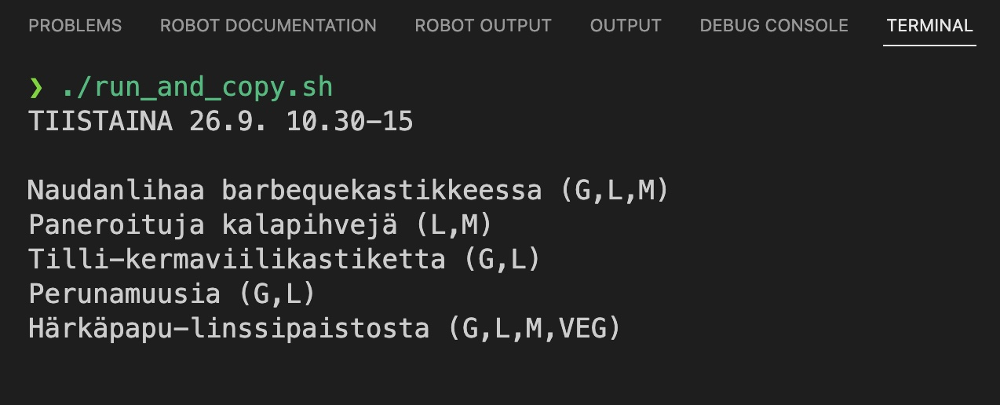

# Robot Framework Selenium - Lunch Menu Download

This project utilizes Robot Framework and Selenium to automate the task of fetching the lunch menu from ABC station. Originally created as a practical exploration into automation and testing.

## Quick Start

1. Clone the repository:

```bash
git clone https://github.com/nikokarvinen/lunchmenu.git
cd lunch-automation
```

2. Build the Docker image:

```bash
docker build -t lunch_robot .
```

3. Run the script:

```bash
./run_and_copy.sh
```



## Repository contents

    - Dockerfile: Contains the Docker configuration to set up the required environment.
    - lunch.robot: The main Robot Framework script to fetch the lunch menu.
    - run_and_copy.sh: A Bash script to run the Docker container and extract the fetched menu.
    - README.md: This file, providing an overview and usage instructions for the project.

## What I Learned

    - Comprehensive usage of Robot Framework and Selenium.
    - Containerizing the automation script using Docker.
    - Addressing challenges such as dynamic web content and browser compatibility.
    - The art of automating repetitive tasks.
